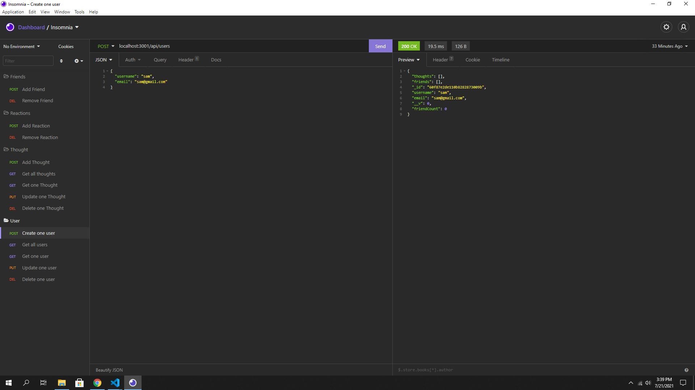

  <h1 align="center">Cdubs Social Media Back-End</h1>
  
 
## Description
A complete back-end for a social media site that includes the ability to create users, add friends, post your thoughts, and react to those thoughts.
## Table of Contents
- [Description](#description)
- [Installation](#installation)
- [Usage](#usage)
- [License](#license)
- [Contributing](#contributing)
- [Tests](#tests)
- [Questions](#questions)
## Installation
💾 once the code is downloaded, type npm install in the CL to download all dependencies and make sure you are connected to a Mongo Database. Once downloaded and connected, run the service by typing node server.js in the CL.
## Usage
💻 A pre-built back-end service for a social media site. 
Here are video walk-throughs using Insomnia

[Video Demo 1- User, Friends, Thought routes](https://drive.google.com/file/d/1AkAK0W-fH1xb0BLxOnGgtbRtWvslQZw6/view?usp=sharing)

[Video Demo 2- Reaction Routes](https://drive.google.com/file/d/1JTwjKkJtgNWQU0ciGTItdUi2mDBiQ_0J/view?usp=sharing)

And here is an example of one the routes using Insomnia.

## License
   This application is covered by the MIT license.
## Contributing
👪 Chris Winters
## Tests
✏️ Insomnia or Postman are great apps to test routes. 
## Questions
🙋‍♂️ Email or reach me on my GitHub  
 
:octocat: Find me on GitHub: [cwinters87](https://github.com/cwinters87) 
 
✉️ Email me with any questions: taylor314@gmail.com  
🌟This README was generated by Chris Winters using the [readme-generator](https://github.com/cwinters87/readme-generator)